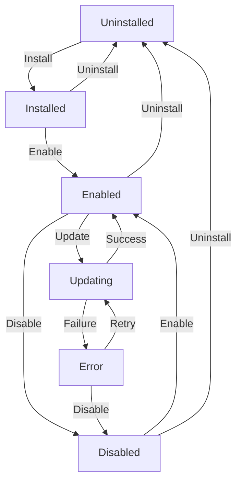

# Plugin Lifecycle Management

Understanding the plugin lifecycle is crucial for building robust Qirvo plugins. This guide covers all lifecycle hooks, state management, and best practices for handling plugin transitions.

## Table of Contents

- [Lifecycle Overview](#lifecycle-overview)
- [Lifecycle Hooks](#lifecycle-hooks)
- [State Management](#state-management)
- [Error Handling](#error-handling)
- [Resource Management](#resource-management)
- [Best Practices](#best-practices)

## Lifecycle Overview

### Plugin States

A Qirvo plugin goes through several states during its lifetime:

```typescript
enum PluginState {
  UNINSTALLED = 'uninstalled',
  INSTALLED = 'installed',
  ENABLED = 'enabled',
  DISABLED = 'disabled',
  UPDATING = 'updating',
  ERROR = 'error'
}
```

### State Transitions



### Lifecycle Flow

```typescript
export default class LifecycleAwarePlugin extends BasePlugin {
  private state: PluginState = PluginState.UNINSTALLED;
  private resources: Map<string, any> = new Map();
  private timers: NodeJS.Timeout[] = [];

  // Installation lifecycle
  async onInstall(context: PluginRuntimeContext): Promise<void> {
    this.log('info', 'Plugin installation started');
    this.state = PluginState.INSTALLED;
    
    try {
      await this.performInstallation(context);
      this.log('info', 'Plugin installed successfully');
    } catch (error) {
      this.state = PluginState.ERROR;
      this.log('error', 'Installation failed:', error);
      throw error;
    }
  }

  // Activation lifecycle
  async onEnable(context: PluginRuntimeContext): Promise<void> {
    this.log('info', 'Plugin activation started');
    
    try {
      await this.performActivation(context);
      this.state = PluginState.ENABLED;
      this.log('info', 'Plugin enabled successfully');
    } catch (error) {
      this.state = PluginState.ERROR;
      this.log('error', 'Activation failed:', error);
      throw error;
    }
  }

  // Deactivation lifecycle
  async onDisable(): Promise<void> {
    this.log('info', 'Plugin deactivation started');
    
    try {
      await this.performDeactivation();
      this.state = PluginState.DISABLED;
      this.log('info', 'Plugin disabled successfully');
    } catch (error) {
      this.state = PluginState.ERROR;
      this.log('error', 'Deactivation failed:', error);
      throw error;
    }
  }

  // Uninstallation lifecycle
  async onUninstall(): Promise<void> {
    this.log('info', 'Plugin uninstallation started');
    
    try {
      await this.performUninstallation();
      this.state = PluginState.UNINSTALLED;
      this.log('info', 'Plugin uninstalled successfully');
    } catch (error) {
      this.state = PluginState.ERROR;
      this.log('error', 'Uninstallation failed:', error);
      throw error;
    }
  }

  // Update lifecycle
  async onUpdate(context: PluginRuntimeContext, oldVersion: string): Promise<void> {
    this.log('info', `Plugin update started: ${oldVersion} → ${context.plugin.version}`);
    this.state = PluginState.UPDATING;
    
    try {
      await this.performUpdate(context, oldVersion);
      this.state = PluginState.ENABLED;
      this.log('info', 'Plugin updated successfully');
    } catch (error) {
      this.state = PluginState.ERROR;
      this.log('error', 'Update failed:', error);
      throw error;
    }
  }
}
```

## Lifecycle Hooks

### Installation Hook (`onInstall`)

Called when the plugin is first installed:

```typescript
async onInstall(context: PluginRuntimeContext): Promise<void> {
  // Initialize default configuration
  const defaultConfig = {
    enabled: true,
    theme: 'auto',
    refreshInterval: 300000, // 5 minutes
    notifications: true
  };
  
  await this.setStorage('config', defaultConfig);
  await this.setStorage('installDate', new Date().toISOString());
  
  // Create necessary database tables or storage structures
  await this.initializeStorage();
  
  // Set up default permissions
  await this.requestInitialPermissions();
  
  // Show welcome message
  await this.notify(
    'Plugin Installed',
    `${context.plugin.name} has been installed successfully!`,
    'success'
  );
  
  // Track installation analytics
  await this.trackEvent('plugin_installed', {
    version: context.plugin.version,
    timestamp: new Date().toISOString()
  });
}

private async initializeStorage(): Promise<void> {
  // Initialize storage with default data structures
  await this.setStorage('userData', {});
  await this.setStorage('cache', {});
  await this.setStorage('preferences', {});
  
  // Create indexes for better performance
  await this.setStorage('indexes', {
    userDataByDate: {},
    cacheByKey: {},
    preferencesByCategory: {}
  });
}

private async requestInitialPermissions(): Promise<void> {
  // Request only essential permissions during installation
  const essentialPermissions = ['storage-read', 'storage-write'];
  
  for (const permission of essentialPermissions) {
    if (!this.hasPermission(this.context, permission)) {
      this.log('warn', `Essential permission not granted: ${permission}`);
    }
  }
}
```

### Activation Hook (`onEnable`)

Called when the plugin is enabled:

```typescript
async onEnable(context: PluginRuntimeContext): Promise<void> {
  // Load configuration
  const config = await this.getStorage('config') || {};
  this.config = { ...this.defaultConfig, ...config };
  
  // Initialize services
  await this.initializeServices(context);
  
  // Set up event listeners
  this.setupEventListeners(context);
  
  // Start background tasks
  await this.startBackgroundTasks();
  
  // Restore previous state if applicable
  await this.restoreState();
  
  // Update last enabled timestamp
  await this.setStorage('lastEnabled', new Date().toISOString());
  
  this.log('info', 'Plugin enabled and ready');
}

private async initializeServices(context: PluginRuntimeContext): Promise<void> {
  // Initialize external service connections
  if (this.config.enableWeatherService) {
    this.weatherService = new WeatherService(this.config.weatherApiKey);
    await this.weatherService.initialize();
  }
  
  // Initialize database connections
  if (this.config.enableDatabase) {
    this.database = new DatabaseService(this.config.databaseUrl);
    await this.database.connect();
  }
  
  // Initialize caching layer
  this.cache = new CacheService({
    maxSize: this.config.cacheSize || 1000,
    ttl: this.config.cacheTtl || 300000
  });
}

private setupEventListeners(context: PluginRuntimeContext): void {
  // Listen for relevant events
  const unsubscribers = [
    context.bus.on('user.preferences.changed', this.handleUserPreferencesChange.bind(this)),
    context.bus.on('system.theme.changed', this.handleThemeChange.bind(this)),
    context.bus.on('plugin.config.changed', this.handleConfigChange.bind(this))
  ];
  
  // Store unsubscribers for cleanup
  this.resources.set('eventUnsubscribers', unsubscribers);
}

private async startBackgroundTasks(): Promise<void> {
  // Start periodic data refresh
  if (this.config.autoRefresh) {
    const refreshTimer = setInterval(
      () => this.refreshData(),
      this.config.refreshInterval
    );
    this.timers.push(refreshTimer);
  }
  
  // Start cleanup task
  const cleanupTimer = setInterval(
    () => this.performCleanup(),
    24 * 60 * 60 * 1000 // Daily
  );
  this.timers.push(cleanupTimer);
}
```

### Deactivation Hook (`onDisable`)

Called when the plugin is disabled:

```typescript
async onDisable(): Promise<void> {
  // Save current state
  await this.saveState();
  
  // Stop background tasks
  this.stopBackgroundTasks();
  
  // Clean up event listeners
  this.cleanupEventListeners();
  
  // Close service connections
  await this.closeServiceConnections();
  
  // Clear caches
  await this.clearCaches();
  
  // Update last disabled timestamp
  await this.setStorage('lastDisabled', new Date().toISOString());
  
  this.log('info', 'Plugin disabled successfully');
}

private async saveState(): Promise<void> {
  const currentState = {
    timestamp: new Date().toISOString(),
    config: this.config,
    activeConnections: this.getActiveConnections(),
    pendingTasks: this.getPendingTasks(),
    userSession: this.getUserSessionData()
  };
  
  await this.setStorage('savedState', currentState);
}

private stopBackgroundTasks(): void {
  // Clear all timers
  this.timers.forEach(timer => clearInterval(timer));
  this.timers = [];
  
  // Cancel pending promises
  this.cancelPendingOperations();
}

private cleanupEventListeners(): void {
  const unsubscribers = this.resources.get('eventUnsubscribers') || [];
  unsubscribers.forEach((unsubscribe: () => void) => unsubscribe());
  this.resources.delete('eventUnsubscribers');
}

private async closeServiceConnections(): Promise<void> {
  // Close external service connections
  if (this.weatherService) {
    await this.weatherService.disconnect();
    this.weatherService = null;
  }
  
  if (this.database) {
    await this.database.disconnect();
    this.database = null;
  }
  
  // Close WebSocket connections
  const websockets = this.resources.get('websockets') || [];
  websockets.forEach((ws: WebSocket) => ws.close());
  this.resources.delete('websockets');
}
```

### Uninstallation Hook (`onUninstall`)

Called when the plugin is being uninstalled:

```typescript
async onUninstall(): Promise<void> {
  // Ensure plugin is disabled first
  if (this.state === PluginState.ENABLED) {
    await this.onDisable();
  }
  
  // Export user data for backup
  await this.exportUserData();
  
  // Clean up all stored data
  await this.cleanupStoredData();
  
  // Remove external resources
  await this.removeExternalResources();
  
  // Revoke permissions
  await this.revokePermissions();
  
  // Show farewell message
  await this.notify(
    'Plugin Uninstalled',
    `${this.context.plugin.name} has been removed. Thank you for using our plugin!`,
    'info'
  );
  
  // Track uninstallation analytics
  await this.trackEvent('plugin_uninstalled', {
    version: this.context.plugin.version,
    reason: 'user_initiated',
    timestamp: new Date().toISOString()
  });
}

private async exportUserData(): Promise<void> {
  try {
    const userData = await this.getAllUserData();
    
    if (Object.keys(userData).length > 0) {
      // Create export file
      const exportData = {
        plugin: this.context.plugin.name,
        version: this.context.plugin.version,
        exportDate: new Date().toISOString(),
        data: userData
      };
      
      // Save to downloads or show download dialog
      await this.createDataExport(exportData);
      
      await this.notify(
        'Data Exported',
        'Your plugin data has been exported for backup',
        'success'
      );
    }
  } catch (error) {
    this.log('error', 'Failed to export user data:', error);
  }
}

private async cleanupStoredData(): Promise<void> {
  // Get all storage keys for this plugin
  const keys = await this.context.storage.keys();
  
  // Remove all plugin data
  for (const key of keys) {
    await this.context.storage.delete(key);
  }
  
  this.log('info', `Cleaned up ${keys.length} storage entries`);
}

private async removeExternalResources(): Promise<void> {
  // Remove uploaded files
  await this.removeUploadedFiles();
  
  // Cancel external subscriptions
  await this.cancelExternalSubscriptions();
  
  // Remove webhook registrations
  await this.removeWebhooks();
}
```

### Update Hook (`onUpdate`)

Called when the plugin is being updated:

```typescript
async onUpdate(context: PluginRuntimeContext, oldVersion: string): Promise<void> {
  this.log('info', `Updating from version ${oldVersion} to ${context.plugin.version}`);
  
  // Backup current data before update
  await this.backupDataForUpdate(oldVersion);
  
  // Perform version-specific migrations
  await this.performMigrations(oldVersion, context.plugin.version);
  
  // Update configuration schema
  await this.updateConfigurationSchema(context);
  
  // Refresh permissions if needed
  await this.updatePermissions(context);
  
  // Re-initialize with new version
  await this.reinitializeAfterUpdate(context);
  
  // Clean up old version artifacts
  await this.cleanupOldVersionData(oldVersion);
  
  // Show update notification
  await this.notify(
    'Plugin Updated',
    `${context.plugin.name} has been updated to version ${context.plugin.version}`,
    'success'
  );
}

private async performMigrations(oldVersion: string, newVersion: string): Promise<void> {
  const migrations = this.getMigrations();
  
  for (const migration of migrations) {
    if (this.shouldRunMigration(migration, oldVersion, newVersion)) {
      this.log('info', `Running migration: ${migration.name}`);
      
      try {
        await migration.run(this);
        await this.setStorage(`migration_${migration.name}`, {
          completed: true,
          timestamp: new Date().toISOString()
        });
      } catch (error) {
        this.log('error', `Migration ${migration.name} failed:`, error);
        throw error;
      }
    }
  }
}

private getMigrations(): Migration[] {
  return [
    {
      name: 'v1.0.0_to_v1.1.0',
      fromVersion: '1.0.0',
      toVersion: '1.1.0',
      run: async (plugin: BasePlugin) => {
        // Migrate old config format to new format
        const oldConfig = await plugin.getStorage('settings');
        if (oldConfig) {
          const newConfig = this.transformConfigV1toV1_1(oldConfig);
          await plugin.setStorage('config', newConfig);
          await plugin.context.storage.delete('settings');
        }
      }
    },
    {
      name: 'v1.1.0_to_v2.0.0',
      fromVersion: '1.1.0',
      toVersion: '2.0.0',
      run: async (plugin: BasePlugin) => {
        // Major version migration
        await this.migrateToV2(plugin);
      }
    }
  ];
}
```

### Configuration Change Hook (`onConfigChange`)

Called when plugin configuration is updated:

```typescript
async onConfigChange(
  context: PluginRuntimeContext, 
  oldConfig: Record<string, any>
): Promise<void> {
  this.log('info', 'Configuration changed');
  
  const newConfig = context.config;
  
  // Validate new configuration
  const validation = await this.validateConfiguration(newConfig);
  if (!validation.valid) {
    throw new Error(`Invalid configuration: ${validation.errors.join(', ')}`);
  }
  
  // Handle specific configuration changes
  await this.handleConfigurationChanges(oldConfig, newConfig);
  
  // Update internal state
  this.config = { ...this.config, ...newConfig };
  
  // Restart services if needed
  await this.restartServicesIfNeeded(oldConfig, newConfig);
  
  // Save configuration
  await this.setStorage('config', this.config);
  await this.setStorage('configLastUpdated', new Date().toISOString());
}

private async handleConfigurationChanges(
  oldConfig: Record<string, any>,
  newConfig: Record<string, any>
): Promise<void> {
  
  // Handle API key changes
  if (oldConfig.apiKey !== newConfig.apiKey) {
    await this.updateApiKey(newConfig.apiKey);
  }
  
  // Handle refresh interval changes
  if (oldConfig.refreshInterval !== newConfig.refreshInterval) {
    await this.updateRefreshInterval(newConfig.refreshInterval);
  }
  
  // Handle theme changes
  if (oldConfig.theme !== newConfig.theme) {
    await this.updateTheme(newConfig.theme);
  }
  
  // Handle notification settings
  if (oldConfig.notifications !== newConfig.notifications) {
    await this.updateNotificationSettings(newConfig.notifications);
  }
}

private async restartServicesIfNeeded(
  oldConfig: Record<string, any>,
  newConfig: Record<string, any>
): Promise<void> {
  
  // Restart external services if connection parameters changed
  const connectionParams = ['apiKey', 'serverUrl', 'timeout'];
  const needsRestart = connectionParams.some(param => 
    oldConfig[param] !== newConfig[param]
  );
  
  if (needsRestart) {
    this.log('info', 'Restarting services due to configuration changes');
    
    // Stop current services
    await this.closeServiceConnections();
    
    // Reinitialize with new configuration
    await this.initializeServices(this.context);
  }
}
```

## State Management

### State Persistence

```typescript
class PluginStateManager {
  constructor(private plugin: BasePlugin) {}

  async saveState(): Promise<void> {
    const state = {
      timestamp: new Date().toISOString(),
      pluginState: this.plugin.state,
      configuration: this.plugin.config,
      userSession: await this.getUserSessionState(),
      activeConnections: await this.getActiveConnectionsState(),
      pendingOperations: await this.getPendingOperationsState()
    };

    await this.plugin.setStorage('pluginState', state);
  }

  async restoreState(): Promise<void> {
    const savedState = await this.plugin.getStorage('pluginState');
    
    if (!savedState) {
      this.plugin.log('info', 'No saved state found');
      return;
    }

    // Restore configuration
    if (savedState.configuration) {
      this.plugin.config = savedState.configuration;
    }

    // Restore user session
    if (savedState.userSession) {
      await this.restoreUserSession(savedState.userSession);
    }

    // Restore connections
    if (savedState.activeConnections) {
      await this.restoreConnections(savedState.activeConnections);
    }

    // Resume pending operations
    if (savedState.pendingOperations) {
      await this.resumePendingOperations(savedState.pendingOperations);
    }

    this.plugin.log('info', 'Plugin state restored successfully');
  }

  private async getUserSessionState(): Promise<any> {
    return {
      lastActivity: new Date().toISOString(),
      activeFeatures: this.getActiveFeatures(),
      userPreferences: await this.plugin.getStorage('userPreferences')
    };
  }

  private async restoreUserSession(sessionState: any): Promise<void> {
    if (sessionState.userPreferences) {
      await this.plugin.setStorage('userPreferences', sessionState.userPreferences);
    }

    // Restore active features
    if (sessionState.activeFeatures) {
      await this.restoreActiveFeatures(sessionState.activeFeatures);
    }
  }
}
```

### State Validation

```typescript
class StateValidator {
  static validatePluginState(state: any): { valid: boolean; errors: string[] } {
    const errors: string[] = [];

    // Validate required fields
    if (!state.timestamp) {
      errors.push('State timestamp is required');
    }

    if (!state.pluginState) {
      errors.push('Plugin state is required');
    }

    // Validate state values
    if (state.pluginState && !Object.values(PluginState).includes(state.pluginState)) {
      errors.push(`Invalid plugin state: ${state.pluginState}`);
    }

    // Validate configuration
    if (state.configuration && typeof state.configuration !== 'object') {
      errors.push('Configuration must be an object');
    }

    // Validate timestamp format
    if (state.timestamp && isNaN(Date.parse(state.timestamp))) {
      errors.push('Invalid timestamp format');
    }

    return {
      valid: errors.length === 0,
      errors
    };
  }

  static sanitizeState(state: any): any {
    return {
      timestamp: state.timestamp || new Date().toISOString(),
      pluginState: state.pluginState || PluginState.INSTALLED,
      configuration: state.configuration || {},
      userSession: state.userSession || {},
      activeConnections: state.activeConnections || [],
      pendingOperations: state.pendingOperations || []
    };
  }
}
```

## Error Handling

### Lifecycle Error Recovery

```typescript
class LifecycleErrorHandler {
  constructor(private plugin: BasePlugin) {}

  async handleInstallationError(error: Error): Promise<void> {
    this.plugin.log('error', 'Installation failed:', error);

    // Attempt to clean up partial installation
    try {
      await this.cleanupPartialInstallation();
    } catch (cleanupError) {
      this.plugin.log('error', 'Cleanup after installation failure also failed:', cleanupError);
    }

    // Notify user
    await this.plugin.notify(
      'Installation Failed',
      `Failed to install ${this.plugin.context.plugin.name}: ${error.message}`,
      'error'
    );

    // Set error state
    this.plugin.state = PluginState.ERROR;
  }

  async handleActivationError(error: Error): Promise<void> {
    this.plugin.log('error', 'Activation failed:', error);

    // Attempt graceful degradation
    try {
      await this.attemptGracefulDegradation();
    } catch (degradationError) {
      this.plugin.log('error', 'Graceful degradation failed:', degradationError);
      
      // Force disable if degradation fails
      await this.forceDisable();
    }
  }

  private async cleanupPartialInstallation(): Promise<void> {
    // Remove any partially created resources
    const keys = await this.plugin.context.storage.keys();
    for (const key of keys) {
      await this.plugin.context.storage.delete(key);
    }

    // Cancel any pending operations
    await this.cancelPendingOperations();
  }

  private async attemptGracefulDegradation(): Promise<void> {
    // Disable non-essential features
    this.plugin.config.enableAdvancedFeatures = false;
    this.plugin.config.enableExternalServices = false;

    // Try to enable with minimal functionality
    await this.plugin.enableMinimalMode();
  }

  private async forceDisable(): Promise<void> {
    try {
      await this.plugin.onDisable();
    } catch (error) {
      this.plugin.log('error', 'Force disable failed:', error);
      // Set error state as last resort
      this.plugin.state = PluginState.ERROR;
    }
  }
}
```

## Resource Management

### Resource Cleanup

```typescript
class ResourceManager {
  private resources = new Map<string, any>();
  private timers: NodeJS.Timeout[] = [];
  private intervals: NodeJS.Timeout[] = [];
  private eventListeners: (() => void)[] = [];

  addTimer(timer: NodeJS.Timeout): void {
    this.timers.push(timer);
  }

  addInterval(interval: NodeJS.Timeout): void {
    this.intervals.push(interval);
  }

  addEventListener(unsubscribe: () => void): void {
    this.eventListeners.push(unsubscribe);
  }

  addResource(name: string, resource: any): void {
    this.resources.set(name, resource);
  }

  async cleanup(): Promise<void> {
    // Clear timers
    this.timers.forEach(timer => clearTimeout(timer));
    this.timers = [];

    // Clear intervals
    this.intervals.forEach(interval => clearInterval(interval));
    this.intervals = [];

    // Remove event listeners
    this.eventListeners.forEach(unsubscribe => unsubscribe());
    this.eventListeners = [];

    // Clean up resources
    for (const [name, resource] of this.resources.entries()) {
      try {
        if (resource && typeof resource.cleanup === 'function') {
          await resource.cleanup();
        } else if (resource && typeof resource.close === 'function') {
          await resource.close();
        } else if (resource && typeof resource.disconnect === 'function') {
          await resource.disconnect();
        }
      } catch (error) {
        console.error(`Failed to cleanup resource ${name}:`, error);
      }
    }

    this.resources.clear();
  }

  getResourceCount(): number {
    return this.resources.size + this.timers.length + this.intervals.length + this.eventListeners.length;
  }
}
```

## Best Practices

### 1. Graceful Degradation

```typescript
export default class ResilientPlugin extends BasePlugin {
  async onEnable(context: PluginRuntimeContext): Promise<void> {
    // Try to enable all features, but continue with reduced functionality if some fail
    const features = [
      { name: 'core', init: () => this.initializeCore(context), required: true },
      { name: 'external', init: () => this.initializeExternalServices(context), required: false },
      { name: 'advanced', init: () => this.initializeAdvancedFeatures(context), required: false }
    ];

    const enabledFeatures: string[] = [];
    const failedFeatures: string[] = [];

    for (const feature of features) {
      try {
        await feature.init();
        enabledFeatures.push(feature.name);
      } catch (error) {
        this.log('error', `Failed to initialize ${feature.name}:`, error);
        failedFeatures.push(feature.name);
        
        if (feature.required) {
          throw error; // Fail completely if required feature fails
        }
      }
    }

    // Update configuration based on what actually worked
    await this.updateFeatureStatus(enabledFeatures, failedFeatures);
    
    this.log('info', `Plugin enabled with features: ${enabledFeatures.join(', ')}`);
    if (failedFeatures.length > 0) {
      this.log('warn', `Failed features: ${failedFeatures.join(', ')}`);
    }
  }
}
```

### 2. Idempotent Operations

```typescript
export default class IdempotentPlugin extends BasePlugin {
  async onInstall(context: PluginRuntimeContext): Promise<void> {
    // Check if already installed
    const installDate = await this.getStorage('installDate');
    if (installDate) {
      this.log('info', 'Plugin already installed, skipping installation');
      return;
    }

    // Perform installation
    await this.performInstallation(context);
  }

  async onEnable(context: PluginRuntimeContext): Promise<void> {
    // Check if already enabled
    if (this.state === PluginState.ENABLED) {
      this.log('info', 'Plugin already enabled');
      return;
    }

    // Perform activation
    await this.performActivation(context);
  }

  private async performInstallation(context: PluginRuntimeContext): Promise<void> {
    // Use transactions or atomic operations where possible
    try {
      await this.beginTransaction();
      
      await this.setStorage('installDate', new Date().toISOString());
      await this.setStorage('version', context.plugin.version);
      await this.initializeDefaultData();
      
      await this.commitTransaction();
    } catch (error) {
      await this.rollbackTransaction();
      throw error;
    }
  }
}
```

### 3. Comprehensive Logging

```typescript
export default class WellLoggedPlugin extends BasePlugin {
  async onInstall(context: PluginRuntimeContext): Promise<void> {
    const startTime = Date.now();
    this.log('info', 'Installation started', {
      pluginName: context.plugin.name,
      version: context.plugin.version,
      userId: context.user?.id
    });

    try {
      await this.performInstallation(context);
      
      const duration = Date.now() - startTime;
      this.log('info', 'Installation completed successfully', {
        duration,
        timestamp: new Date().toISOString()
      });
    } catch (error) {
      const duration = Date.now() - startTime;
      this.log('error', 'Installation failed', {
        error: error.message,
        stack: error.stack,
        duration,
        timestamp: new Date().toISOString()
      });
      throw error;
    }
  }

  private async performInstallation(context: PluginRuntimeContext): Promise<void> {
    this.log('debug', 'Initializing storage');
    await this.initializeStorage();
    
    this.log('debug', 'Setting up default configuration');
    await this.setupDefaultConfiguration();
    
    this.log('debug', 'Requesting initial permissions');
    await this.requestInitialPermissions();
    
    this.log('debug', 'Installation steps completed');
  }
}
```

This comprehensive guide covers all aspects of plugin lifecycle management, ensuring your plugins handle state transitions gracefully and maintain data integrity throughout their lifetime.

---

**Next**: [Best Practices](./best-practices.md) for comprehensive development guidelines.
